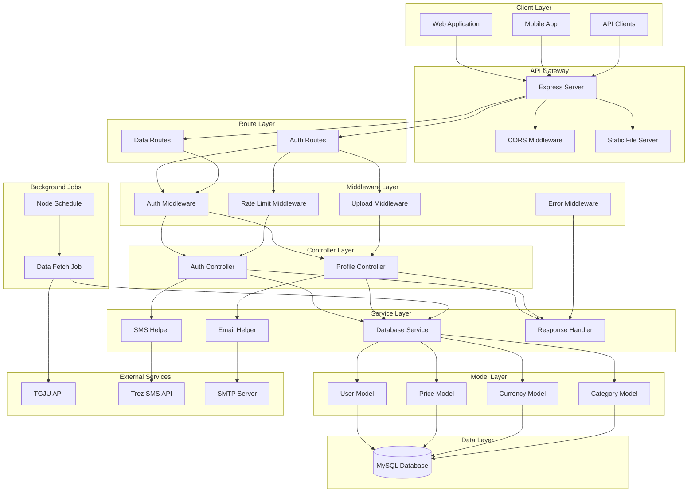
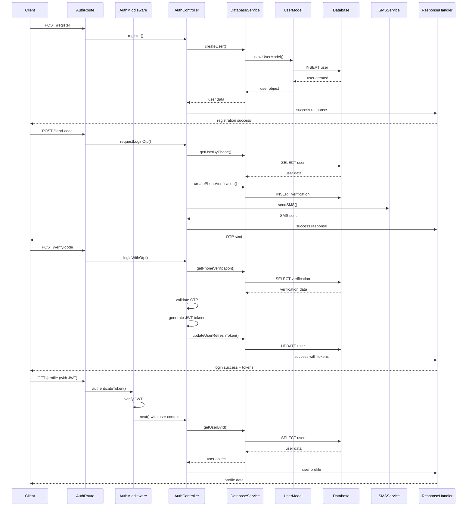
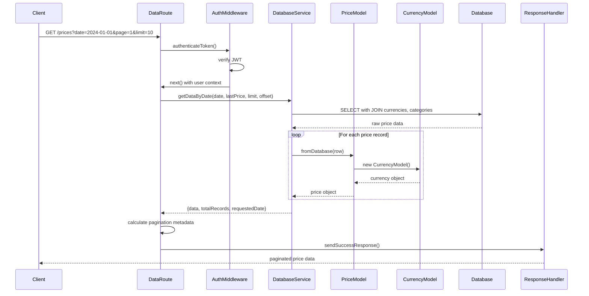
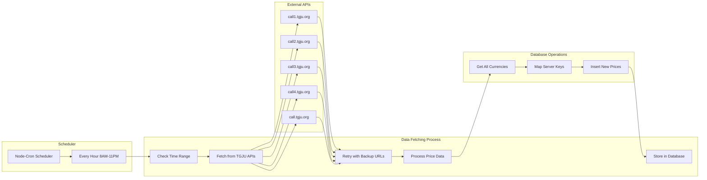
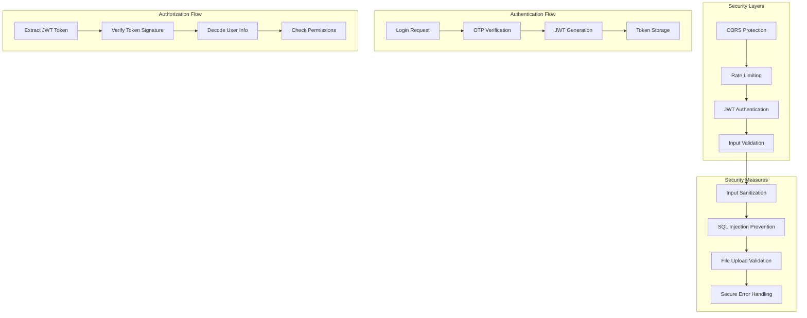

# دیاگرام‌های کامپوننت سیستم

## دیاگرام کامپوننت‌های اصلی

## دیاگرام جریان احراز هویت

## دیاگرام جریان دریافت داده

## دیاگرام Background Jobs

## دیاگرام امنیت و احراز هویت

## مسئولیت‌های هر کامپوننت

### 1. **Express Server**
- HTTP server management
- Middleware orchestration
- Route registration
- Static file serving
- Error handling

### 2. **Route Layer**
- URL pattern matching
- HTTP method handling
- Parameter extraction
- Controller delegation

### 3. **Middleware Layer**
- Cross-cutting concerns
- Request preprocessing
- Response postprocessing
- Security enforcement

### 4. **Controller Layer**
- Request/response handling
- Business logic coordination
- Service layer orchestration
- Data transformation

### 5. **Service Layer**
- Business logic implementation
- Data access coordination
- External service integration
- Transaction management

### 6. **Model Layer**
- Data representation
- Validation rules
- Transformation methods
- Business rules

### 7. **Database Layer**
- Data persistence
- Query execution
- Connection management
- Transaction handling