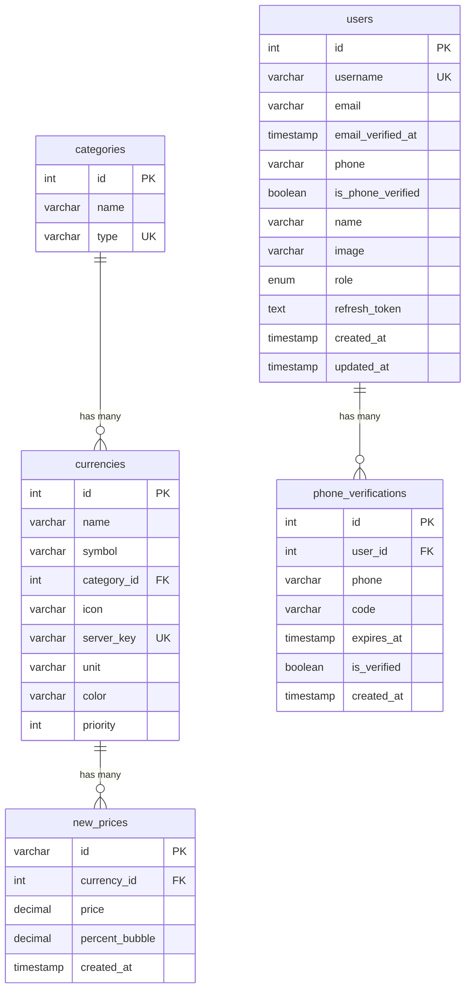

# مستندات Schema دیتابیس

## نمای کلی

دیتابیس Finoo از MySQL استفاده می‌کند و شامل 5 جدول اصلی است که اطلاعات کاربران، ارزها، قیمت‌ها و تایید شماره موبایل را مدیریت می‌کند.

## دیاگرام روابط (ERD)



---

## جداول دیتابیس

### 1. جدول `users`

جدول اصلی کاربران سیستم.

#### ساختار جدول
```sql
CREATE TABLE users (
    id INT AUTO_INCREMENT PRIMARY KEY,
    username VARCHAR(255) UNIQUE NOT NULL,
    email VARCHAR(255) NULL,
    email_verified_at TIMESTAMP NULL,
    phone VARCHAR(20) NULL,
    is_phone_verified BOOLEAN DEFAULT FALSE,
    name VARCHAR(255) NULL,
    image VARCHAR(255) NULL,
    role ENUM('user', 'admin') DEFAULT 'user',
    refresh_token TEXT NULL,
    created_at TIMESTAMP DEFAULT CURRENT_TIMESTAMP,
    updated_at TIMESTAMP DEFAULT CURRENT_TIMESTAMP ON UPDATE CURRENT_TIMESTAMP
);
```

#### فیلدها
| فیلد | نوع | Null | پیش‌فرض | توضیحات |
|------|-----|------|---------|---------|
| `id` | INT | NO | AUTO_INCREMENT | شناسه یکتا کاربر |
| `username` | VARCHAR(255) | NO | - | نام کاربری یکتا |
| `email` | VARCHAR(255) | YES | NULL | آدرس ایمیل |
| `email_verified_at` | TIMESTAMP | YES | NULL | زمان تایید ایمیل |
| `phone` | VARCHAR(20) | YES | NULL | شماره موبایل |
| `is_phone_verified` | BOOLEAN | NO | FALSE | وضعیت تایید شماره موبایل |
| `name` | VARCHAR(255) | YES | NULL | نام نمایشی کاربر |
| `image` | VARCHAR(255) | YES | NULL | مسیر تصویر پروفایل |
| `role` | ENUM | NO | 'user' | نقش کاربر (user/admin) |
| `refresh_token` | TEXT | YES | NULL | JWT refresh token |
| `created_at` | TIMESTAMP | NO | CURRENT_TIMESTAMP | زمان ایجاد |
| `updated_at` | TIMESTAMP | NO | CURRENT_TIMESTAMP | زمان آخرین بروزرسانی |

#### ایندکس‌ها
```sql
-- Primary Key
PRIMARY KEY (id)

-- Unique Constraints
UNIQUE KEY username (username)

-- Indexes for performance
INDEX idx_phone (phone)
INDEX idx_email (email)
```

#### ویژگی‌های خاص
- **Auto Username Generation**: اگر username ارسال نشود، به صورت خودکار تولید می‌شود
- **Email Verification**: سیستم تایید ایمیل با token
- **Phone Verification**: سیستم تایید شماره موبایل با OTP
- **Role-based Access**: پشتیبانی از نقش‌های مختلف کاربر

---

### 2. جدول `categories`

دسته‌بندی انواع ارزها و دارایی‌ها.

#### ساختار جدول
```sql
CREATE TABLE categories (
    id INT AUTO_INCREMENT PRIMARY KEY,
    name VARCHAR(255) NOT NULL,
    type VARCHAR(100) UNIQUE NOT NULL
);
```

#### فیلدها
| فیلد | نوع | Null | پیش‌فرض | توضیحات |
|------|-----|------|---------|---------|
| `id` | INT | NO | AUTO_INCREMENT | شناسه یکتا دسته‌بندی |
| `name` | VARCHAR(255) | NO | - | نام نمایشی دسته‌بندی |
| `type` | VARCHAR(100) | NO | - | نوع دسته‌بندی (یکتا) |

#### ایندکس‌ها
```sql
-- Primary Key
PRIMARY KEY (id)

-- Unique Constraints
UNIQUE KEY type (type)
```

#### نمونه داده‌ها
```sql
INSERT INTO categories (name, type) VALUES
('ارز', 'currency'),
('رمزارز', 'crypto'),
('فلز گرانبها', 'metal'),
('سهام', 'stock');
```

---

### 3. جدول `currencies`

اطلاعات ارزها و دارایی‌های مالی.

#### ساختار جدول
```sql
CREATE TABLE currencies (
    id INT AUTO_INCREMENT PRIMARY KEY,
    name VARCHAR(255) NOT NULL,
    symbol VARCHAR(50) NOT NULL,
    category_id INT NOT NULL,
    icon VARCHAR(255) NULL,
    server_key VARCHAR(100) UNIQUE NOT NULL,
    unit VARCHAR(10) NOT NULL DEFAULT 'IRR',
    color VARCHAR(7) DEFAULT '#FFFFFF',
    priority INT DEFAULT 100,
    FOREIGN KEY (category_id) REFERENCES categories(id) ON DELETE RESTRICT
);
```

#### فیلدها
| فیلد | نوع | Null | پیش‌فرض | توضیحات |
|------|-----|------|---------|---------|
| `id` | INT | NO | AUTO_INCREMENT | شناسه یکتا ارز |
| `name` | VARCHAR(255) | NO | - | نام کامل ارز |
| `symbol` | VARCHAR(50) | NO | - | نماد ارز |
| `category_id` | INT | NO | - | شناسه دسته‌بندی |
| `icon` | VARCHAR(255) | YES | NULL | نام فایل آیکن |
| `server_key` | VARCHAR(100) | NO | - | کلید یکتا برای API خارجی |
| `unit` | VARCHAR(10) | NO | 'IRR' | واحد قیمت (IRR/USD) |
| `color` | VARCHAR(7) | NO | '#FFFFFF' | رنگ نمایش (HEX) |
| `priority` | INT | NO | 100 | اولویت نمایش |

#### ایندکس‌ها
```sql
-- Primary Key
PRIMARY KEY (id)

-- Foreign Keys
FOREIGN KEY (category_id) REFERENCES categories(id) ON DELETE RESTRICT

-- Unique Constraints
UNIQUE KEY server_key (server_key)

-- Indexes for performance
INDEX idx_symbol (symbol)
INDEX idx_priority (priority)
INDEX idx_category_priority (category_id, priority)
```

#### نمونه داده‌ها
```sql
INSERT INTO currencies (name, symbol, category_id, server_key, unit, color, priority) VALUES
('دلار آمریکا', 'USD', 1, 'price_dollar_rl', 'IRR', '#22c55e', 1),
('یورو', 'EUR', 1, 'price_eur', 'IRR', '#3b82f6', 2),
('بیت کوین', 'BTC', 2, 'price_bit', 'USD', '#f59e0b', 5),
('طلا', 'GOLD', 3, 'sekee', 'IRR', '#fbbf24', 10);
```

---

### 4. جدول `new_prices`

قیمت‌های لحظه‌ای و تاریخی ارزها.

#### ساختار جدول
```sql
CREATE TABLE new_prices (
    id VARCHAR(36) PRIMARY KEY,
    currency_id INT NOT NULL,
    price DECIMAL(15,2) NOT NULL,
    percent_bubble DECIMAL(5,2) NULL,
    created_at TIMESTAMP DEFAULT CURRENT_TIMESTAMP,
    FOREIGN KEY (currency_id) REFERENCES currencies(id) ON DELETE CASCADE
);
```

#### فیلدها
| فیلد | نوع | Null | پیش‌فرض | توضیحات |
|------|-----|------|---------|---------|
| `id` | VARCHAR(36) | NO | - | UUID یکتا |
| `currency_id` | INT | NO | - | شناسه ارز |
| `price` | DECIMAL(15,2) | NO | - | قیمت ارز |
| `percent_bubble` | DECIMAL(5,2) | YES | NULL | درصد حباب |
| `created_at` | TIMESTAMP | NO | CURRENT_TIMESTAMP | زمان ثبت قیمت |

#### ایندکس‌ها
```sql
-- Primary Key
PRIMARY KEY (id)

-- Foreign Keys
FOREIGN KEY (currency_id) REFERENCES currencies(id) ON DELETE CASCADE

-- Indexes for performance
INDEX idx_currency_date (currency_id, created_at)
INDEX idx_created_at (created_at)
INDEX idx_currency_latest (currency_id, created_at DESC)
```

#### ویژگی‌های خاص
- **UUID Primary Key**: استفاده از UUID برای شناسه یکتا
- **Cascade Delete**: حذف خودکار قیمت‌ها هنگام حذف ارز
- **Bubble Percentage**: محاسبه درصد حباب بازار
- **High Volume**: طراحی برای حجم بالای داده

---

### 5. جدول `phone_verifications`

سیستم تایید شماره موبایل با OTP.

#### ساختار جدول
```sql
CREATE TABLE phone_verifications (
    id INT AUTO_INCREMENT PRIMARY KEY,
    user_id INT NOT NULL,
    phone VARCHAR(20) NOT NULL,
    code VARCHAR(10) NOT NULL,
    expires_at TIMESTAMP NOT NULL,
    is_verified BOOLEAN DEFAULT FALSE,
    created_at TIMESTAMP DEFAULT CURRENT_TIMESTAMP,
    FOREIGN KEY (user_id) REFERENCES users(id) ON DELETE CASCADE
);
```

#### فیلدها
| فیلد | نوع | Null | پیش‌فرض | توضیحات |
|------|-----|------|---------|---------|
| `id` | INT | NO | AUTO_INCREMENT | شناسه یکتا |
| `user_id` | INT | NO | - | شناسه کاربر |
| `phone` | VARCHAR(20) | NO | - | شماره موبایل |
| `code` | VARCHAR(10) | NO | - | کد تایید |
| `expires_at` | TIMESTAMP | NO | - | زمان انقضا |
| `is_verified` | BOOLEAN | NO | FALSE | وضعیت تایید |
| `created_at` | TIMESTAMP | NO | CURRENT_TIMESTAMP | زمان ایجاد |

#### ایندکس‌ها
```sql
-- Primary Key
PRIMARY KEY (id)

-- Foreign Keys
FOREIGN KEY (user_id) REFERENCES users(id) ON DELETE CASCADE

-- Indexes for performance
INDEX idx_user_phone (user_id, phone)
INDEX idx_phone_code (phone, code)
INDEX idx_expires_at (expires_at)
```

#### ویژگی‌های خاص
- **OTP System**: سیستم کد یکبار مصرف
- **Expiration**: کدها 5 دقیقه اعتبار دارند
- **Rate Limiting**: محدودیت تعداد درخواست
- **Cascade Delete**: حذف خودکار هنگام حذف کاربر

---

## روابط بین جداول

### 1. رابطه `users` ↔ `phone_verifications`
- **نوع**: One-to-Many
- **توضیح**: هر کاربر می‌تواند چندین درخواست تایید شماره داشته باشد
- **Foreign Key**: `phone_verifications.user_id → users.id`
- **Delete Action**: CASCADE

### 2. رابطه `categories` ↔ `currencies`
- **نوع**: One-to-Many
- **توضیح**: هر دسته‌بندی می‌تواند شامل چندین ارز باشد
- **Foreign Key**: `currencies.category_id → categories.id`
- **Delete Action**: RESTRICT

### 3. رابطه `currencies` ↔ `new_prices`
- **نوع**: One-to-Many
- **توضیح**: هر ارز می‌تواند چندین قیمت تاریخی داشته باشد
- **Foreign Key**: `new_prices.currency_id → currencies.id`
- **Delete Action**: CASCADE

## Query های مهم

### دریافت قیمت‌های امروز
```sql
SELECT 
    np.id, 
    np.price, 
    np.created_at AS date,
    np.percent_bubble,
    c.name,
    c.symbol,
    c.icon,
    c.color,
    c.unit,
    c.priority,
    cat.name as category_name,
    cat.type as category_type
FROM new_prices np
INNER JOIN (
    SELECT currency_id, MAX(created_at) AS max_date
    FROM new_prices
    WHERE DATE(created_at) = CURDATE()
    GROUP BY currency_id
) latest ON np.currency_id = latest.currency_id 
    AND np.created_at = latest.max_date
INNER JOIN currencies c ON np.currency_id = c.id
LEFT JOIN categories cat ON c.category_id = cat.id
ORDER BY c.priority ASC;
```

### جستجو با فیلتر
```sql
SELECT 
    np.id, 
    np.price, 
    np.created_at AS date,
    c.name,
    c.symbol,
    cat.type as category_type
FROM new_prices np
INNER JOIN currencies c ON np.currency_id = c.id
LEFT JOIN categories cat ON c.category_id = cat.id
WHERE c.symbol = ? 
    AND cat.type = ?
ORDER BY c.priority ASC, np.created_at DESC
LIMIT ? OFFSET ?;
```

### تایید شماره موبایل
```sql
SELECT * FROM phone_verifications
WHERE user_id = ? 
    AND phone = ?
    AND code = ?
    AND expires_at > NOW()
    AND is_verified = FALSE
ORDER BY created_at DESC
LIMIT 1;
```

## بهینه‌سازی عملکرد

### ایندکس‌های مهم
1. **Composite Index**: `(currency_id, created_at)` برای query های قیمت
2. **Date Index**: `created_at` برای فیلتر تاریخی
3. **Priority Index**: `priority` برای مرتب‌سازی
4. **Phone Index**: `phone` برای جستجوی سریع

### پارتیشن‌بندی (اختیاری)
```sql
-- پارتیشن‌بندی جدول new_prices بر اساس تاریخ
ALTER TABLE new_prices 
PARTITION BY RANGE (YEAR(created_at)) (
    PARTITION p2023 VALUES LESS THAN (2024),
    PARTITION p2024 VALUES LESS THAN (2025),
    PARTITION p2025 VALUES LESS THAN (2026)
);
```

## نکات امنیتی

1. **Parameterized Queries**: استفاده از prepared statements
2. **Input Validation**: اعتبارسنجی ورودی‌ها
3. **Connection Pooling**: مدیریت اتصالات
4. **Backup Strategy**: پشتیبان‌گیری منظم
5. **Access Control**: کنترل دسترسی سطح دیتابیس