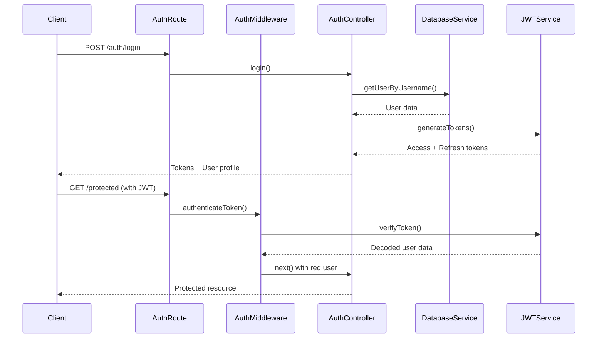

# Authentication و Middleware Patterns

## نمای کلی

این سند شامل راهنمای کامل سیستم احراز هویت، الگوهای middleware و بهترین روش‌های امنیتی در پروژه Finoo Backend است.

## معماری Authentication

### جریان کلی احراز هویت



## JWT Token Management

### Token Structure

#### Access Token
```javascript
{
  "id": 123,
  "username": "user_123456",
  "role": "user",
  "iat": 1640995200,    // Issued at
  "exp": 1643587200     // Expires at (30 days)
}
```

#### Refresh Token
```javascript
{
  "id": 123,
  "username": "user_123456",
  "iat": 1640995200,    // Issued at
  "exp": 1646179200     // Expires at (60 days)
}
```

### Token Generation

```javascript
// controllers/authController.js
function generateTokens(user) {
    const payload = {
        id: user.id,
        username: user.username,
        role: user.role
    };

    const accessToken = jwt.sign(
        payload,
        process.env.SECRET_KEY,
        { expiresIn: process.env.ACCESS_TOKEN_EXPIRY || "7d" }
    );

    const refreshToken = jwt.sign(
        { id: user.id, username: user.username },
        process.env.REFRESH_SECRET_KEY,
        { expiresIn: process.env.REFRESH_TOKEN_EXPIRY || "15d" }
    );

    return { accessToken, refreshToken };
}

// مثال استفاده در login
exports.login = async (req, res) => {
    try {
        const { username } = req.body;
        
        // Validation
        if (!username || username.trim() === "") {
            return sendErrorResponse(res, 400, "نام کاربری مورد نیاز است");
        }

        // Get user from database
        const userData = await getUserByUsername(username);
        if (!userData) {
            return sendErrorResponse(res, 401, "نام کاربری صحیح نیست");
        }

        // Generate tokens
        const { accessToken, refreshToken } = generateTokens(userData);

        // Save refresh token to database
        await updateUserRefreshToken(userData.id, refreshToken);

        return sendSuccessResponse(res, {
            profile: userData.toProfileJSON(),
            authentication: {
                access_token: accessToken,
                refresh_token: refreshToken,
            },
        });
    } catch (err) {
        return sendErrorResponse(res, 500, "خطا در ورود کاربر");
    }
};
```

### Token Refresh

```javascript
exports.refreshToken = async (req, res) => {
    const { refreshToken } = req.body;

    if (!refreshToken) {
        return sendErrorResponse(res, 400, "کد بازیابی نیاز است");
    }

    try {
        // Verify refresh token
        const decoded = jwt.verify(refreshToken, process.env.REFRESH_SECRET_KEY);

        // Check if user exists and token is valid
        const user = await getUserById(decoded.id);
        if (!user) {
            return sendErrorResponse(res, 403, "کد بازیابی درست نیست");
        }

        // Generate new access token
        const newAccessToken = jwt.sign(
            { 
                id: decoded.id, 
                username: user.username,
                role: user.role 
            },
            process.env.SECRET_KEY,
            { expiresIn: "30d" }
        );

        return sendSuccessResponse(res, { 
            accessToken: newAccessToken 
        });
    } catch (err) {
        if (err.name === 'TokenExpiredError') {
            return sendErrorResponse(res, 403, "کد بازیابی منقضی شده است");
        } else if (err.name === 'JsonWebTokenError') {
            return sendErrorResponse(res, 403, "کد بازیابی نامعتبر است");
        } else {
            return sendErrorResponse(res, 403, "خطا در تمدید کد دسترسی");
        }
    }
};
```

## Authentication Middleware

### فایل: `middlewares/authMiddleware.js`

```javascript
const jwt = require("jsonwebtoken");
const { sendErrorResponse } = require("../utils/responseHandler");

/**
 * Middleware برای احراز هویت JWT token
 * @param {Object} req - Express request object
 * @param {Object} res - Express response object
 * @param {Function} next - Express next function
 */
function authenticateToken(req, res, next) {
    const authHeader = req.headers["authorization"];
    const token = authHeader && authHeader.split(" ")[1]; // Bearer TOKEN

    if (!token) {
        return sendErrorResponse(res, 401, "کد دسترسی مورد نیاز است", "AUTH_MISSING_TOKEN");
    }

    jwt.verify(token, process.env.SECRET_KEY, (err, user) => {
        if (err) {
            // تشخیص نوع خطای JWT
            if (err.name === 'TokenExpiredError') {
                return sendErrorResponse(res, 403, "کد دسترسی منقضی شده است", "AUTH_TOKEN_EXPIRED");
            } else if (err.name === 'JsonWebTokenError') {
                return sendErrorResponse(res, 403, "کد دسترسی نامعتبر است", "AUTH_INVALID_TOKEN");
            } else if (err.name === 'NotBeforeError') {
                return sendErrorResponse(res, 403, "کد دسترسی هنوز فعال نیست", "AUTH_TOKEN_NOT_ACTIVE");
            } else {
                return sendErrorResponse(res, 403, "خطا در اعتبارسنجی کد دسترسی", "AUTH_TOKEN_ERROR");
            }
        }

        // اضافه کردن اطلاعات کاربر به request
        req.user = user;
        next();
    });
}

module.exports = authenticateToken;
```

### استفاده در Routes

```javascript
// routes/dataRoutes.js
const authenticateToken = require("../middlewares/authMiddleware");

// تمام route های data نیاز به authentication دارند
router.get("/prices", authenticateToken, async (req, res) => {
    // منطق دریافت قیمت‌ها
    // req.user شامل اطلاعات کاربر احراز هویت شده است
});

router.get("/search", authenticateToken, async (req, res) => {
    // منطق جستجو
});

// routes/authRoutes.js
// فقط برخی route های auth نیاز به authentication دارند
router.get("/profile", authenticateToken, profileController.getProfile);
router.post("/update-profile", authenticateToken, upload.single("image"), profileController.updateProfile);
```

## Role-Based Access Control (RBAC)

### Role Middleware

```javascript
// middlewares/roleMiddleware.js
const { sendErrorResponse } = require("../utils/responseHandler");

/**
 * Middleware برای بررسی نقش کاربر
 * @param {string|Array} allowedRoles - نقش‌های مجاز
 * @returns {Function} Express middleware function
 */
function requireRole(allowedRoles) {
    // تبدیل به آرایه اگر string باشد
    const roles = Array.isArray(allowedRoles) ? allowedRoles : [allowedRoles];
    
    return (req, res, next) => {
        // بررسی وجود اطلاعات کاربر (باید قبلاً authenticate شده باشد)
        if (!req.user) {
            return sendErrorResponse(res, 401, "احراز هویت مورد نیاز است", "AUTH_REQUIRED");
        }

        // بررسی نقش کاربر
        if (!roles.includes(req.user.role)) {
            return sendErrorResponse(res, 403, "دسترسی مجاز نیست", "ACCESS_FORBIDDEN");
        }

        next();
    };
}

// مثال استفاده
// router.get("/admin/users", authenticateToken, requireRole("admin"), adminController.getUsers);
// router.post("/admin/settings", authenticateToken, requireRole(["admin", "moderator"]), adminController.updateSettings);

module.exports = requireRole;
```

## OTP Authentication System

### OTP Generation و Verification

```javascript
// controllers/authController.js

/**
 * درخواست کد OTP برای ورود
 */
exports.requestLoginOtp = async (req, res) => {
    const { phone } = req.body;

    // Validation
    if (!phone) {
        return sendErrorResponse(res, 400, "شماره تلفن الزامی است", "MISSING_PHONE");
    }

    // Phone format validation
    const phoneRegex = /^09[0-9]{9}$/;
    if (!phoneRegex.test(phone)) {
        return sendErrorResponse(res, 400, "فرمت شماره تلفن صحیح نیست", "INVALID_PHONE_FORMAT");
    }

    try {
        let user = await getUserByPhone(phone);

        // اگر کاربر وجود نداشت، کاربر جدید ایجاد کن
        if (!user) {
            user = await createUserWithPhone(phone);
            if (!user) {
                return sendErrorResponse(res, 500, "خطا در ایجاد کاربر جدید");
            }
        }

        // بررسی محدودیت تعداد درخواست (Rate limiting)
        const recentRequests = await countPhoneVerificationsLast5Minutes(user.id);
        if (recentRequests >= 3) {
            return sendErrorResponse(res, 429, "تعداد درخواست‌های شما بیش از حد مجاز است. لطفاً 5 دقیقه صبر کنید", "TOO_MANY_REQUESTS");
        }

        // تولید کد 6 رقمی امن
        const code = require('crypto').randomInt(100000, 999999).toString();
        const expiresAt = new Date(Date.now() + 2 * 60 * 1000); // 2 دقیقه

        // ذخیره کد در دیتابیس
        await createPhoneVerification(user.id, phone, code, expiresAt);

        // ارسال SMS
        const smsResult = await sendSMS(phone, `اپلیکیشن فینو\nکد ورود: ${code}`);
        if (!smsResult.success) {
            return sendErrorResponse(res, 500, "ارسال پیامک با خطا مواجه شد", "SMS_FAILED");
        }

        return sendSuccessResponse(res, { 
            message: "کد تایید ارسال شد",
            expiresIn: 300 // 5 minutes in seconds
        });
    } catch (err) {
        console.error("❌ requestLoginOtp error:", err);
        return sendErrorResponse(res, 500, "خطا در ارسال کد ورود");
    }
};

/**
 * تایید کد OTP و ورود
 */
exports.loginWithOtp = async (req, res) => {
    const { phone, code } = req.body;

    // Validation
    if (!phone || !code) {
        return sendErrorResponse(res, 400, "شماره و کد الزامی هستند", "MISSING_FIELDS");
    }

    if (code.length !== 6 || !/^\d+$/.test(code)) {
        return sendErrorResponse(res, 400, "کد باید 6 رقم باشد", "INVALID_CODE_FORMAT");
    }

    try {
        let user = await getUserByPhone(phone);
        
        if (!user) {
            return sendErrorResponse(res, 404, "کاربر یافت نشد", "USER_NOT_FOUND");
        }

        // بررسی کد تایید
        const verification = await getPhoneVerification(user.id, phone);
        if (!verification) {
            return sendErrorResponse(res, 400, "کد تایید یافت نشد", "VERIFICATION_NOT_FOUND");
        }

        if (verification.code !== code) {
            return sendErrorResponse(res, 400, "کد اشتباه است", "INVALID_CODE");
        }

        if (new Date(verification.expires_at) < new Date()) {
            return sendErrorResponse(res, 400, "کد منقضی شده است", "CODE_EXPIRED");
        }

        // تولید JWT tokens
        const { accessToken, refreshToken } = generateTokens(user);

        // ذخیره refresh token
        await updateUserRefreshToken(user.id, refreshToken);

        // علامت‌گذاری کد به عنوان استفاده شده
        await markVerificationAsUsed(verification.id);

        return sendSuccessResponse(res, {
            profile: user.toProfileJSON(),
            authentication: {
                access_token: accessToken,
                refresh_token: refreshToken,
            },
        });
    } catch (err) {
        console.error("❌ loginWithOtp error:", err);
        return sendErrorResponse(res, 500, "خطا در ورود با OTP");
    }
};
```

## Rate Limiting Middleware

### Basic Rate Limiting

```javascript
// middlewares/rateLimitMiddleware.js
const rateLimit = require("express-rate-limit");

// Rate limiter برای ثبت نام
const registerLimiter = rateLimit({
    windowMs: 1 * 60 * 1000, // 1 دقیقه
    max: 20, // حداکثر 20 درخواست در دقیقه
    message: {
        status: 429,
        error: "تلاش برای ثبت نام بسیار زیاد است، لطفاً بعداً دوباره امتحان کنید.",
        code: "RATE_LIMIT_EXCEEDED"
    },
    standardHeaders: true, // اضافه کردن headers استاندارد
    legacyHeaders: false, // حذف headers قدیمی
    keyGenerator: (req) => {
        // استفاده از IP و User-Agent برای شناسایی
        return `${req.ip}-${req.get('User-Agent')}`;
    },
    skip: (req) => {
        // Skip کردن برای IP های خاص (مثلاً localhost در development)
        return process.env.NODE_ENV === 'development' && req.ip === '127.0.0.1';
    }
});

// Rate limiter برای OTP
const otpLimiter = rateLimit({
    windowMs: 5 * 60 * 1000, // 5 دقیقه
    max: 3, // حداکثر 3 درخواست در 5 دقیقه
    message: {
        status: 429,
        error: "تعداد درخواست‌های شما بیش از حد مجاز است. لطفاً 5 دقیقه صبر کنید.",
        code: "OTP_RATE_LIMIT_EXCEEDED"
    },
    keyGenerator: (req) => {
        // Rate limiting بر اساس شماره تلفن
        return req.body.phone || req.ip;
    }
});

// Rate limiter عمومی برای API
const apiLimiter = rateLimit({
    windowMs: 15 * 60 * 1000, // 15 دقیقه
    max: 1000, // حداکثر 1000 درخواست در 15 دقیقه
    message: {
        status: 429,
        error: "تعداد درخواست‌های شما بیش از حد مجاز است.",
        code: "API_RATE_LIMIT_EXCEEDED"
    }
});

module.exports = {
    registerLimiter,
    otpLimiter,
    apiLimiter
};
```

### Advanced Rate Limiting با Redis

```javascript
// middlewares/advancedRateLimit.js
const redis = require('redis');
const client = redis.createClient(process.env.REDIS_URL);

/**
 * Advanced rate limiting با sliding window
 * @param {Object} options - تنظیمات rate limiting
 * @returns {Function} Express middleware
 */
function createAdvancedRateLimit(options) {
    const {
        windowMs = 60000,     // 1 minute
        maxRequests = 100,    // max requests per window
        keyGenerator = (req) => req.ip,
        message = "Too many requests"
    } = options;

    return async (req, res, next) => {
        try {
            const key = `rate_limit:${keyGenerator(req)}`;
            const now = Date.now();
            const windowStart = now - windowMs;

            // حذف درخواست‌های قدیمی
            await client.zremrangebyscore(key, 0, windowStart);

            // شمارش درخواست‌های فعلی
            const currentRequests = await client.zcard(key);

            if (currentRequests >= maxRequests) {
                return res.status(429).json({
                    status: 429,
                    error: message,
                    retryAfter: Math.ceil(windowMs / 1000)
                });
            }

            // اضافه کردن درخواست فعلی
            await client.zadd(key, now, `${now}-${Math.random()}`);
            await client.expire(key, Math.ceil(windowMs / 1000));

            next();
        } catch (error) {
            console.error('Rate limiting error:', error);
            // در صورت خطا، اجازه ادامه بده
            next();
        }
    };
}
```

## File Upload Middleware

### Multer Configuration

```javascript
// middlewares/uploadMiddleware.js
const multer = require("multer");
const path = require("path");
const fs = require("fs");

// تنظیمات storage
const storage = multer.diskStorage({
    destination: (req, file, cb) => {
        const uploadPath = "uploads/profiles";
        
        // ایجاد پوشه در صورت عدم وجود
        if (!fs.existsSync(uploadPath)) {
            fs.mkdirSync(uploadPath, { recursive: true });
        }
        
        cb(null, uploadPath);
    },
    filename: (req, file, cb) => {
        // تولید نام یکتا برای فایل
        const uniqueSuffix = Date.now() + '-' + Math.round(Math.random() * 1E9);
        const filename = `user_${req.user.id}_${uniqueSuffix}${path.extname(file.originalname)}`;
        cb(null, filename);
    },
});

// فیلتر نوع فایل
const fileFilter = (req, file, cb) => {
    const allowedTypes = ["image/jpeg", "image/png", "image/jpg", "image/webp"];
    const allowedExtensions = [".jpeg", ".jpg", ".png", ".webp"];
    const fileExtension = path.extname(file.originalname).toLowerCase();

    if (
        !allowedTypes.includes(file.mimetype) ||
        !allowedExtensions.includes(fileExtension)
    ) {
        return cb(
            new Error("نوع فایل نامعتبر است. فقط JPEG، PNG، JPG و WebP مجاز هستند."),
            false
        );
    }
    
    cb(null, true);
};

// تنظیمات multer
const upload = multer({
    storage,
    fileFilter,
    limits: { 
        fileSize: 5 * 1024 * 1024, // 5MB
        files: 1 // فقط یک فایل
    },
});

// Middleware برای مدیریت خطاهای upload
function handleUploadError(err, req, res, next) {
    if (err instanceof multer.MulterError) {
        if (err.code === 'LIMIT_FILE_SIZE') {
            return sendErrorResponse(res, 400, "حجم فایل بیش از 5 مگابایت است", "FILE_TOO_LARGE");
        } else if (err.code === 'LIMIT_FILE_COUNT') {
            return sendErrorResponse(res, 400, "تعداد فایل‌ها بیش از حد مجاز است", "TOO_MANY_FILES");
        } else if (err.code === 'LIMIT_UNEXPECTED_FILE') {
            return sendErrorResponse(res, 400, "فیلد فایل نامعتبر است", "INVALID_FILE_FIELD");
        } else {
            return sendErrorResponse(res, 400, "خطا در آپلود فایل", "UPLOAD_ERROR");
        }
    } else if (err) {
        return sendErrorResponse(res, 400, err.message, "FILE_VALIDATION_ERROR");
    }
    next();
}

module.exports = {
    upload,
    handleUploadError
};
```

## Security Middleware

### CORS Configuration

```javascript
// middlewares/corsMiddleware.js
const cors = require('cors');

const corsOptions = {
    origin: function (origin, callback) {
        // لیست دامنه‌های مجاز
        const allowedOrigins = [
            'https://finoo.ir',
            'https://www.finoo.ir',
            'https://app.finoo.ir'
        ];
        
        // اجازه دسترسی بدون origin برای mobile apps
        if (!origin) return callback(null, true);
        
        if (allowedOrigins.includes(origin)) {
            callback(null, true);
        } else {
            callback(new Error('دسترسی از این دامنه مجاز نیست'));
        }
    },
    methods: ['GET', 'POST', 'PUT', 'DELETE', 'OPTIONS'],
    allowedHeaders: [
        'Origin',
        'X-Requested-With',
        'Content-Type',
        'Accept',
        'Authorization'
    ],
    credentials: true, // اجازه ارسال cookies
    maxAge: 86400 // Cache preflight response for 24 hours
};

module.exports = cors(corsOptions);
```

### Security Headers

```javascript
// middlewares/securityMiddleware.js
function securityHeaders(req, res, next) {
    // X-Content-Type-Options
    res.setHeader('X-Content-Type-Options', 'nosniff');
    
    // X-Frame-Options
    res.setHeader('X-Frame-Options', 'DENY');
    
    // X-XSS-Protection
    res.setHeader('X-XSS-Protection', '1; mode=block');
    
    // Referrer-Policy
    res.setHeader('Referrer-Policy', 'strict-origin-when-cross-origin');
    
    // Content-Security-Policy
    res.setHeader('Content-Security-Policy', "default-src 'self'");
    
    // Remove X-Powered-By header
    res.removeHeader('X-Powered-By');
    
    next();
}

module.exports = securityHeaders;
```

### Input Validation Middleware

```javascript
// middlewares/inputValidationMiddleware.js
const { validatePhoneNumber, validateUsername } = require('../utils/inputValidator');

function validateLoginInput(req, res, next) {
    const { username } = req.body;
    
    if (!username) {
        return sendErrorResponse(res, 400, "نام کاربری مورد نیاز است");
    }
    
    const validation = validateUsername(username);
    if (!validation.valid) {
        return sendErrorResponse(res, 400, validation.error);
    }
    
    req.body.username = validation.username;
    next();
}

function validateOTPInput(req, res, next) {
    const { phone, code } = req.body;
    
    if (!phone) {
        return sendErrorResponse(res, 400, "شماره تلفن الزامی است");
    }
    
    const phoneValidation = validatePhoneNumber(phone);
    if (!phoneValidation.valid) {
        return sendErrorResponse(res, 400, phoneValidation.error);
    }
    
    if (code && (code.length !== 6 || !/^\d+$/.test(code))) {
        return sendErrorResponse(res, 400, "کد باید 6 رقم باشد");
    }
    
    req.body.phone = phoneValidation.phone;
    next();
}

module.exports = {
    validateLoginInput,
    validateOTPInput
};
```

## Middleware Chain Examples

### Protected Route با Multiple Middleware

```javascript
// routes/authRoutes.js
const authenticateToken = require("../middlewares/authMiddleware");
const { upload, handleUploadError } = require("../middlewares/uploadMiddleware");
const { apiLimiter } = require("../middlewares/rateLimitMiddleware");

// مثال: آپدیت پروفایل با authentication، rate limiting و file upload
router.post(
    "/update-profile",
    apiLimiter,                    // Rate limiting
    authenticateToken,             // Authentication
    upload.single("image"),        // File upload
    handleUploadError,             // Upload error handling
    profileController.updateProfile // Controller
);

// مثال: درخواست OTP با rate limiting
router.post(
    "/send-code", 
    otpLimiter,                    // Specific rate limiting for OTP
    authController.requestLoginOtp
);
```

### Admin Route با Role-based Access

```javascript
// routes/adminRoutes.js
const authenticateToken = require("../middlewares/authMiddleware");
const requireRole = require("../middlewares/roleMiddleware");
const { apiLimiter } = require("../middlewares/rateLimitMiddleware");

// فقط admin ها دسترسی دارند
router.get(
    "/users",
    apiLimiter,
    authenticateToken,
    requireRole("admin"),
    adminController.getUsers
);

// admin و moderator دسترسی دارند
router.post(
    "/settings",
    apiLimiter,
    authenticateToken,
    requireRole(["admin", "moderator"]),
    adminController.updateSettings
);
```

## بهترین روش‌ها

### 1. Token Security

```javascript
// ✅ درست: استفاده از environment variables برای secrets
const accessToken = jwt.sign(payload, process.env.SECRET_KEY, { expiresIn: "30d" });

// ✅ درست: استفاده از strong secrets
// در .env فایل:
// SECRET_KEY=your-very-long-and-random-secret-key-here-at-least-32-characters
// REFRESH_SECRET_KEY=another-different-very-long-secret-key-for-refresh-tokens

// ❌ غلط: hardcoded secrets
const accessToken = jwt.sign(payload, "mysecret", { expiresIn: "30d" });
```

### 2. Password Hashing (برای آینده)

```javascript
// اگر در آینده از password استفاده کردید
const bcrypt = require('bcrypt');

// Hash کردن password
async function hashPassword(password) {
    const saltRounds = 12;
    return await bcrypt.hash(password, saltRounds);
}

// مقایسه password
async function comparePassword(password, hashedPassword) {
    return await bcrypt.compare(password, hashedPassword);
}
```

### 3. Secure Session Management

```javascript
// ✅ درست: ذخیره refresh token در دیتابیس
await updateUserRefreshToken(userId, refreshToken);

// ✅ درست: پاک کردن token هنگام logout
await clearUserRefreshToken(refreshToken);

// ✅ درست: بررسی اعتبار token در هر درخواست
const user = await getUserById(decoded.id);
if (!user || user.refresh_token !== refreshToken) {
    return sendErrorResponse(res, 403, "کد بازیابی نامعتبر است");
}
```

### 4. Input Validation

```javascript
// ✅ درست: اعتبارسنجی کامل ورودی‌ها
function validateLoginInput(req, res, next) {
    const { username } = req.body;
    
    if (!username) {
        return sendErrorResponse(res, 400, "نام کاربری مورد نیاز است");
    }
    
    if (typeof username !== 'string') {
        return sendErrorResponse(res, 400, "نام کاربری باید رشته باشد");
    }
    
    if (username.length < 3 || username.length > 50) {
        return sendErrorResponse(res, 400, "نام کاربری باید بین 3 تا 50 کاراکتر باشد");
    }
    
    // Sanitize input
    req.body.username = username.trim().toLowerCase();
    next();
}
```

### 5. Error Handling در Middleware

```javascript
// ✅ درست: مدیریت خطا در middleware
function authenticateToken(req, res, next) {
    try {
        const authHeader = req.headers["authorization"];
        const token = authHeader && authHeader.split(" ")[1];

        if (!token) {
            return sendErrorResponse(res, 401, "کد دسترسی مورد نیاز است");
        }

        jwt.verify(token, process.env.SECRET_KEY, (err, user) => {
            if (err) {
                return sendErrorResponse(res, 403, "کد دسترسی نامعتبر است");
            }
            req.user = user;
            next();
        });
    } catch (error) {
        console.error('Authentication middleware error:', error);
        return sendErrorResponse(res, 500, "خطا در احراز هویت");
    }
}
```